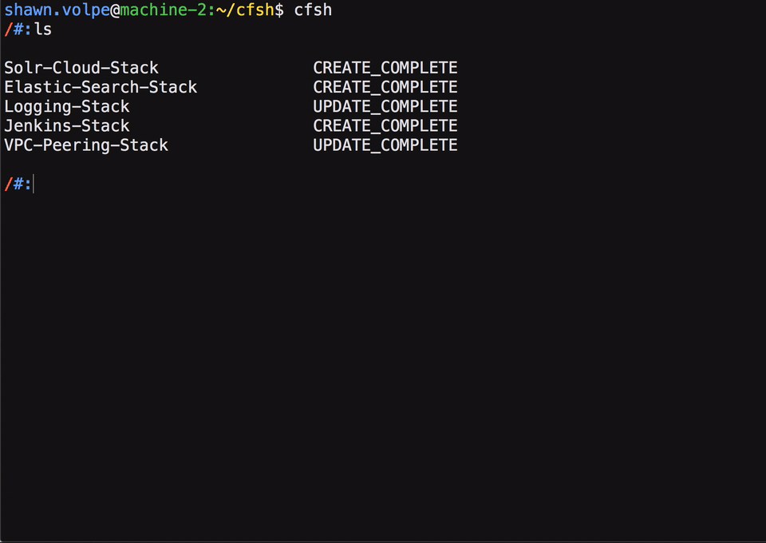
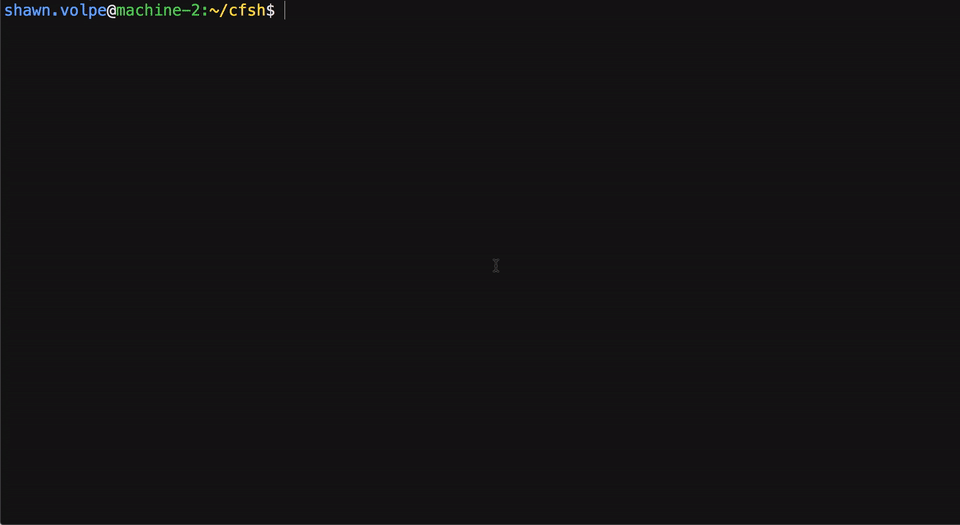
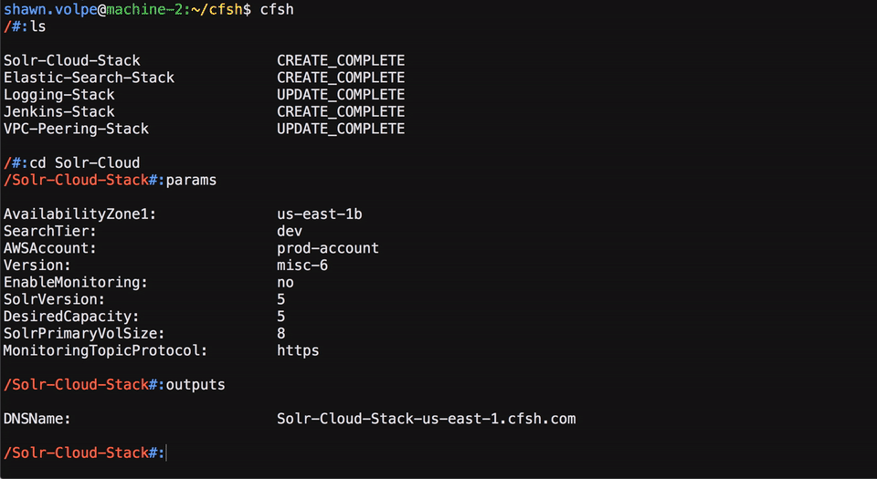
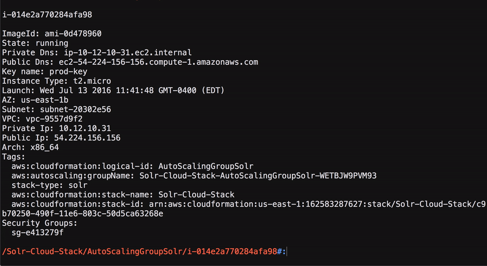

# Cfsh the AWS Shell

Cfsh is a shell that traverses aws resources and allows you to manipulate and control them. If you are comfortable inside the Unix shell then you should feel at home. The behavior and commands mimic Bash as closely as possible. It has the basic navigation commands such as 'ls' and 'cd', you can use the up and down arrow keys to traverse the history of commands and many more.

## Installation
Cfsh is a Node.js project, you can get it [here](https://nodejs.org/en/download/). It relies on Node.js's package manager, npm. Once you have Node.js and npm, install Cfsh with the following:
```
$npm install -g cfsh
$npm link
```
Or install from source with:
```
$git clone https://github.com/svolpe43/cfsh
$cd cfsh
$npm install
$npm link
```
Then to run the project use the following:
```
$cfsh
```

Some commands require ssh access to the instances so make sure your ssh key is added to your key ring prior to running Cfsh.

NOTE: For Linux users, install [xdotools](http://manpages.ubuntu.com/manpages/artful/man1/xdotool.1.html) to enjoy all the commands of CFSH on Linux.(Tested on Ubuntu 16.04)

## Options
Cfsh uses the same authentication as the [AWS cli tool](http://docs.aws.amazon.com/cli/latest/userguide/cli-chap-getting-started.html), so if you can use the AWS cli tool you can use Cfsh. If you use AWS's new standard, the AWS credentials file, you can optionally specify an AWS profile with the -p option. Also, Cfsh defaults to the us-east-1 region but you can specify a AWS region with the -r option.
```
$cfsh -r us-west-1 -p prod-account
```

Cfsh has two modes that change where the root node is set. In the 'cf' all root nodes are CloudFormation stacks and in 'ec2' mode all root nodes are EC2 instances. You can set this option with the -m option. CloudFormation is the default mode if the option is not passed in.
```
$cfsh -m ec2
```

Some commands have options or arguments. To save commonly used ones add aliases to the settings file:
```
aliases : {
	'ls' : 'ls -l'
}
```

## Introduction
```
#:cmds
#:help
```

Exit with:
```
#:exit
```

## Examples

Create and delete stacks just like you would a directory in Bash. ([mk](#mk), [rm](#rm))<br><br>
<br><br>

Gather information about the stacks like parameters, outputs and events. ([params](#params), [outputs](#outputs))<br><br>
<br><br>

Traverse the stack resources and get AWS information and metrics. ([stats](#stats), [info](#info))<br><br>
<br><br>

Use the arrows to scroll through past commands or use `history` to see them. `ssh` into an instance without parameters! ([history](#history), [ssh](#ssh))<br><br>
<br><br>

## Commands

##### Help Plugin
[cmds](#cmds)  
[apps](#apps)  
[help](#help)
##### Navigation Plugin
[ls](#ls)  
[cd](#cd)  
[type](#type)  
[history](#history)
##### Operations Plugin
[mk](#mk)  
[rm](#rm)  
[up](#up)  
##### Stack Plugin
[events](#events)  
[params](#params)  
[tags](#tags)  
[outputs](#outputs)  
##### EC2 Plugin
[info](#info)  
[stats](#stats)  
[cat](#cat)  
[ssh](#ssh)  
[sshall](#sshall)  
[sshrand](#sshrand)  
[sshfw](#sshfw)  
[sync](#sync)  
[exec](#exec)   
[vols](#vols)  
[health](#health)  
[cud](#cud)  
[mirror](#mirror)  
[mirror-stop](#mirror-stop)  
##### Elb Plugin
[dereg](#dereg)  
[reg](#reg)

## Help Plugin

### cmds
```
#:cmds
```
List all available commands.

### apps
```
#:apps
```
List apps currently available. If you drop a CloudFormation template with a '.json' file type into 'cf/', it will show up with this command.

### help
```
#:help
```
The `help` command is equivalent to running the `cmds` command and then the `apps` command.

## Nagivation Plugin

### ls
```
#:ls [path] [option]
```
The `ls` command lists the children of a node. Optioanlly select a node with the path. If the path is not specified the current node is used. The path is bash syntax. For example, '..' is supported.

Path is an optional parameter to `ls`, if it is not supplied it simple uses the current selected node. By passing the '-l' options in this command will give more output.

### cd
```
#:cd <path>
```
The `cd` command will change your current node to the node specified by \<path\>. `cd`  supports bash syntax for the path name. For example, you can use `..` to go to the previous node and `/` to move to the root node.

### type
```
#:type
```
The `type` command outputs the type of the currently selected node. Some commands have different behavior based on the node type that it is invoked on.

### history
```
#:history <num>
```
The `history` command will output your current session's command history. If the `num` option is specified it will show the last `num` commands.

## Operations Plugin

### mk
```
#:mk <type> <stack_name>
```
The `mk` command will create a stack of type \<type\> with the name \<stack_name\>. This command can only be used to make cf stacks.

`mk` can make a stack of any type as long as a CloudFormation template exists for that type. To create your own stack type, simply drop a CF template into the the `cf` directory with the file name following this convention: `<type>.json`. This ensures that the `mk` command can find your CF template. For example, condsider that you were to put a CF template in the cf directory named logging.json. By running `mk logging my-logging-stack`, Cfsh will create a stack using the logging.json template and the stack name will be my-logging-stack. Once the stack is complete you can `cd` into that stack and `ls` to see its resources.

### rm
```
#:rm <stack_name>
```
**Note:** The 'rm' command requires the -r option to delete any stack otherwise it defaults to dry run.

The `rm` commnand deletes the stack specified by \<stack_name\>. You can also pass in a range such as the following to delete multiple stacks at once.
```
#:rm 4-6
```

### up
```
#:up <type> <stack_name>
```
The `up` command updates the stack specified by \<stack_name\> with the CloudFormation template that matches the name specified by \<type\>.

## Stack Plugin

### events
```
#:events
```
The `events` command will output all events for the current stack.

### params
```
#:params
```
The `params` command will output all parameters for the current stack.

### tags
```
#:tags
```
The `tags` command will output all tags for the current stack. (Individual resources coming soon)

### outputs
```
#:outputs
```
The `outputs` command will output all the outputs for the current stack.

## EC2 Plugin

### info
```
#:info
```
The `info` command lists all AWS data of the current ec2 node. It is currently only supported on nodes of type 'Instance'.

### stats
```
#:stats
```
The `stats` command will use ssh to run the `top` command on the ec2 instance. This will output some basic statistics about the
cpu and memory of the instance. This command can be run on an instance node or an Asg node.

### cat
```
#:cat <path_to_file_on_instance>
```
The `cat` command can only be used on a node of type 'Instance'. This command cats the path specified by '\<path_to_file_on_instance\>' on the instance of the current selected node. The path can be a relative path from the home directory of the ssh user or a absolute path.

### ssh
```
#:ssh <path>
```
The `ssh` command simply opens a new terminal tab that will be sshed into the instance using the ssh user specified in settings.js. In order to use this command your current selected node needs to be of type 'Instance'. The ssh command also optionally takes in a path parameter to a given instance node.

### sshall
```
#:sshall
```
The `sshall` command will open up a ssh session in a new tab for every instance in the current selected auto scaling group. The tabs get opened in the order that the stack resources are listed using the `ls` command. Inside the new terminal tabs, the Logical Id or Resource Name is echoed at the top so you can track what resource it belongs to.

### sshrand
```
#:sshrand
```
The `sshrand` command will randomly choose an instance in the current selected autoscaling group and open up a ssh session to that instance in a new tab.

### sshfw
```
#:sshfw [optional forwarding port: '-8080'] [path]:<destination port>
```
The `sshfw` command forwards http requests through an ssh tunnel to a remote machine, allowing you bypass firewalls. The forwarding port and the path are optional while the destination port is mandatory. If path is not specified `sshfw` assumes you mean the current node which must be of type 'Instance'. If you don't specify a forwarding port it will randomly pick a Linux user port (1024 - 49151). The command will then output a url to use in your browser to access the server and open up a tab in your default browser to that local port. The following are some sample commands:

```
// Specify the destination port
// forward localhost[rand port] to [current node's remote host]:8983
#:sshfw 8983
localhost:45892 -> 54.23.56.1:8983

// Specify the path and destination port
//use random forwarding port
#:sshfw i-065:8983
localhost:45892 -> 54.23.56.1:8983

// Specify the forwarding port, path and destination port
// forward localhost:9090 to [remote host at path]:8983
#:sshfw -9090 i-065:8983
localhost:9090 -> 54.23.56.1:8983

```

### sync
```
#:sync /source/path /remote/dest/path
```
The `sync` command uses 'rsync' to push a local file or directory to a remote path. It runs with the options '-azv'. This command works on nodes of type 'Asg' or 'Instance'. If this command is run on a node of type 'Asg' it will sync to every Instance in the Asg. This command runs as root on the target instance.

### exec
```
#:exec "echo 'Hello'"
```
The `exec` command will run the specified command on the target node. This command only works on nodes of type 'Asg' and 'Instance'. If run on a node of type 'Asg' it will execute the command on each instance in the Asg.

### mirror
```
#:mirror <source> <destination>
```
The `mirror` command will open up a watcher process to respond to 'change' events on the local source directory. When a change is detected it will rsync the file to the path specified by 'destination' on the current node. This command works on nodes of type 'Asg' and 'Instance'. If it is run on a node of type 'Asg' it will mirror the file to each instance in the Asg.

'mirror' can be used to mirror directories as well. When doing so do not include the synced directory in the destination path or else you will get 1 extra uneeded depth. For example, in order to mirror a directory /tmp/test-dir to /tmp on the remote instance you can use:
```
#:mirror /tmp/test-dir /tmp/
```
This will end up on the remote instance as /tmp/test-dir/test-dirs-contents instead of /tmp/test-dir/test-dir/test-dirs-contents.

While a watcher process is running you can use the Cfsh terminal like normal by hitting 'enter' to get back to the terminal. Use the 'mirror-stop' command to close the watcher process. Only one watcher process can run at one time.

### mirror-stop
```
#:mirror-stop
```
The `mirror-stop` command can be run on nodes of any type. This will cancel the mirroring process started with 'mirror'.

### vols
```
#:vols
```
The `vols` command outputs the LifecycleState and HealthStatus of the instances in the current selected Auto Scaling Group along with the volumes that are attatched to them. This command currently only looks for devices named '/dev/sdd'. This command can only be used on nodes of type 'Asg'. If this command gains interest then I can add paramaterized device names.

### health
```
#:health <health_state>
```
The `health` command allows you to set the health of an instance in an Auto Scaling Group. The options are 'Unhealthy' and 'Healthy'. This command is currently only supported on nodes of type 'Instance'.

### cud
```
#:cud
```
The `cud` command uses ssh to output the `/var/log/cloud-init-output.log` file from the ec2 instance.

## Elb Plugin

### dereg
```
#:dereg <instance node>
```
Deregister an instance from an Elastic Load Blancer. Only works on nodes of type 'Elb'.

### reg
```
#:reg <full instance id>
```
Register an instance to an Elastic Load Blancer. Only works on nodes of type 'Elb'.
